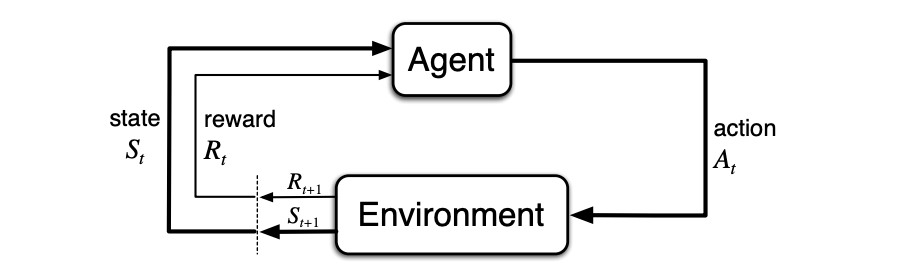
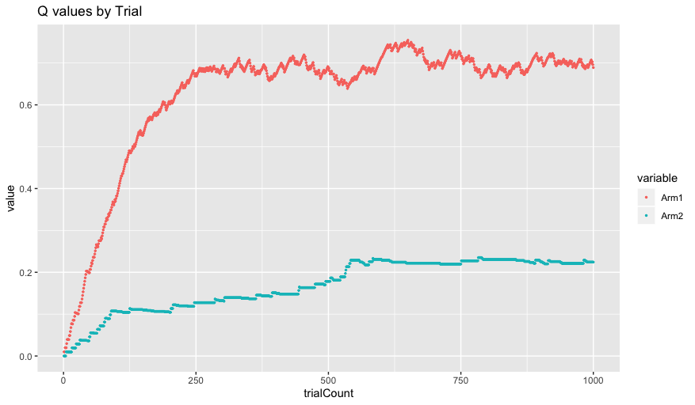
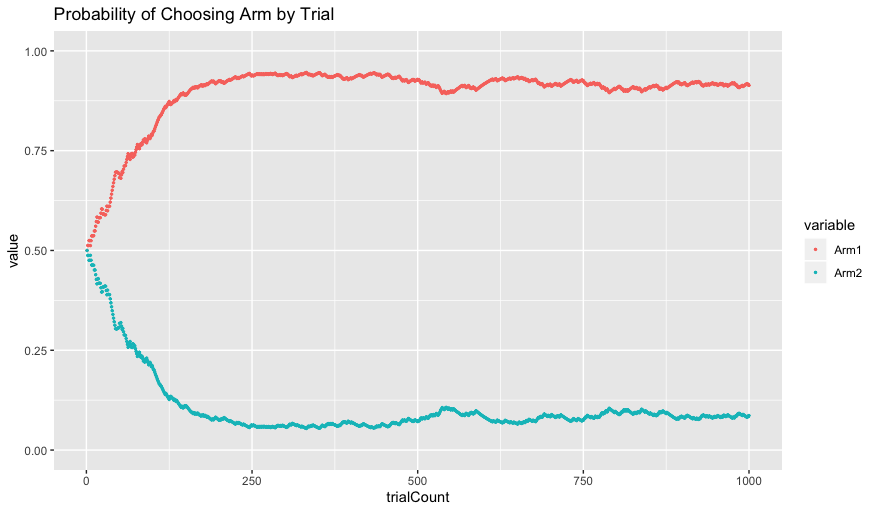
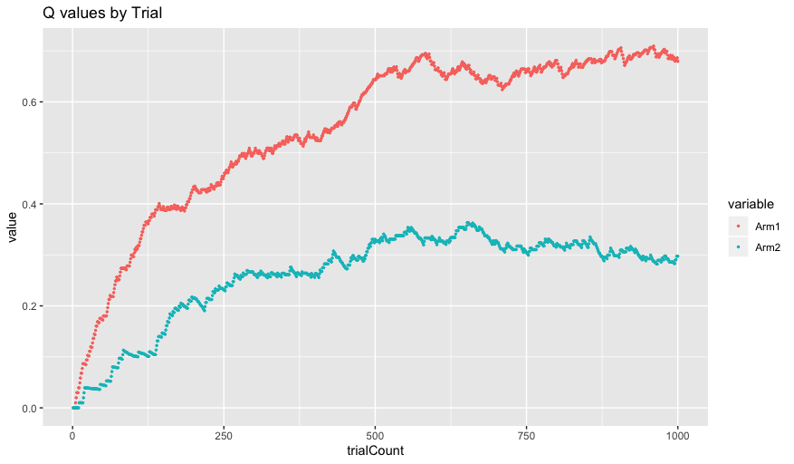
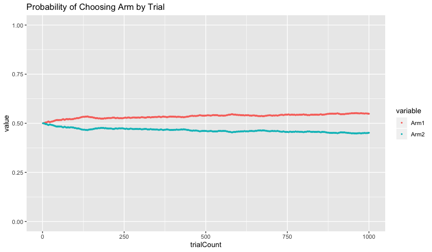
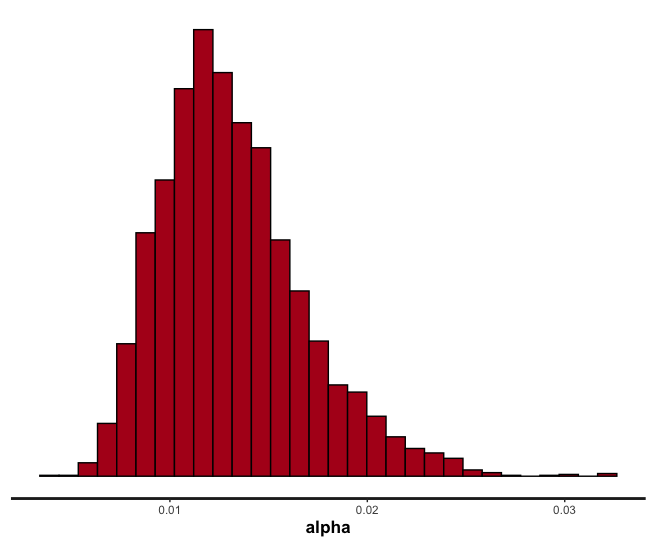
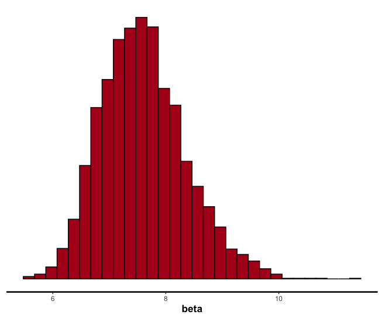

# Reinforcement Learning Resource Guide & Tutorial

This is a resource guide/tutorial for those interested in reinforcement learning and modeling. While not comprehensive, it will hopefully give you a basic understanding of how RL works (and modeling more generally). If you have suggestions for improvements or corrections, please email me at raphael.geddert@duke.edu!

#### Outline

- Reinforcement Learning Introduction
- Background Resources (Math, statistics, modeling, programing)
- Tutorial - Modeling an RL agent performing a k-armed bandit task
- Deep RL (tbd)

------

## Introduction to Reinforcement Learning

Reinforcement learning is the process by which someone learns which of several actions to take in any given situation, by trying these actions numerous times and learning whether these actions are good or bad based on feedback.


<br>Sutton & Barto 2018 agent-environment interaction diagram (Figure 3.1)

Put in more concrete terms, reinforcement learning considers an **agent** that exists in an **environment**. The environment is the world that the agent interacts with. At each time step *t*, the agent is shown a state of the world *s*. This state can be "partially observed", in the sense that the agent might not know everything about how the world has changed, or even if it has changed at all. Regardless, given this state, the agent now chooses one of several **actions**. Learning which action to perform in any given state is the problem reinforcement learning is attempting to solve. After performing an action, the agent receives a **reward** feedback that lets it know whether the action it performed was a good one or not. The agents objective is to maximize reward in the long run, known as the **return**.

There is of course a lot more to RL, such as **policies**, **value functions**, and various **optimization strategies**. A good place to start is this excellent [summary of key concepts in RL](https://spinningup.openai.com/en/latest/spinningup/rl_intro.html). Some of these will be discussed below, so stay tuned!

You may also like:
- [Reinforcement Learning Demystified](https://towardsdatascience.com/reinforcement-learning-demystified-36c39c11ec14) - towardsdatascience.com
- [Basics of Reinforcement Learning](https://medium.com/@zsalloum/basics-of-reinforcement-learning-the-easy-way-fb3a0a44f30e) - Medium.com
- https://github.com/aikorea/awesome-rl
- https://www.quora.com/What-are-the-best-resources-to-learn-Reinforcement-Learning
- https://medium.com/@yuxili/resources-for-deep-reinforcement-learning-a5fdf2dc730f

Finally, it is critical to mention perhaps the most famous of RL resources - the RL bible of sorts - the [2018 Reinforcement Learning Textbook](http://www.incompleteideas.net/book/the-book-2nd.html) by Sutton and Barto. For perspective, the textbook has been cited over 35,000 times in just last the two years. The book is incredibly thorough and comprehensive, but people that are new to RL might find it a bit overwhelming or overly detailed. Still, it is an excellent resource and worth checking out once you feel more comfortable with the basic concepts of RL.

------

## Background Resources

While it is definitely possible to understand and model reinforcement learning without having to learn complicated math or programming topics, these are definitely required if you want a deep understanding of RL. Below are great math/statistics/programming resources to get you started. You can also keep going with the tutorial and come back in case you later realize some more background knowledge might be useful.

**Note:** The Pearson lab already has excellent resources for much of this. Check out their lab website [here](https://pearsonlab.github.io/learning.html).

### Math

- **Linear Algebra:**
  - 3Blue1Brown's [Essence of Linear Algebra](https://www.youtube.com/watch?v=fNk_zzaMoSs&list=PLZHQObOWTQDPD3MizzM2xVFitgF8hE_ab).
  - You kahn practice linear algebra on [khan academy](https://www.khanacademy.org/math/linear-algebra/vectors-and-spaces/vectors/v/vector-introduction-linear-algebra).


- **Statistics:**
  - [Statistical Rethinking with examples in R and Stan](https://xcelab.net/rm/statistical-rethinking/) by Richard McElreath
  - Russ Poldrack's [Statistical Thinking for the 21st Century](https://statsthinking21.github.io/statsthinking21-core-site/).
  - [Introduction to probability and statistics](https://seeing-theory.brown.edu/#firstPage).


- **Calculus**
  - 3Blue1Brown's [Essence of Calculus](https://www.youtube.com/watch?v=WUvTyaaNkzM&list=PLZHQObOWTQDMsr9K-rj53DwVRMYO3t5Yr)
  - Gilbert Strang's [calculus textbook](https://ocw.mit.edu/ans7870/resources/Strang/Edited/Calculus/Calculus.pdf)

### Programming

- **Python:**
  - You can't go wrong with Jake Vanderplas’s [A Whirlwind Tour of Python](https://jakevdp.github.io/WhirlwindTourOfPython/) and [Python Data Science Handbook](https://jakevdp.github.io/PythonDataScienceHandbook/).
  - Software carpentry 1-day [Python tutorial](https://swcarpentry.github.io/python-novice-inflammation/)
  - See also the Egner Lab's [Python resource page](https://github.com/egnerlab/Lab-Manual/tree/master/Programming/Python)


- **R:** There are some tutorials below that use R (because of the RStan package for modeling) so a good understanding would be very useful.
  - [R for Data Science](https://r4ds.had.co.nz/) by Hadley Wickham.
  - [Advanced R](https://adv-r.hadley.nz/), again by Hadley Wickham.
  - This great [youtube tutorial](https://www.youtube.com/watch?v=jWjqLW-u3hc&app=desktop) on dplyr.


- **Misc:**
  - [Stan](https://mc-stan.org/) and specifically [RStan](https://mc-stan.org/users/interfaces/rstan) for modeling. These will be covered in more detail below.

------

## Your First Reinforcement Learning Model

This next section goes through a tutorial on fitting a model of a multi-armed bandit task. First, you will simulate an agent completing the task. This involves determining both how the agent chooses which of several actions to perform (i.e., its policy) as well as how it learns which of these actions to prioritize based on feedback from the environment (i.e., rewards). Next, you will perform parameter estimation using the negative log likelihood to estimate the parameters that determined the agents behavior.

### A Multi-Armed Bandit task

Consider the following learning problem. You are at a casino, and in front of you are three slot machines. You have 100 spin tokens that you got for your birthday from your parents, where one token will let you spin one slot machine one time. You know from a friend that works at the casino that the slot machines have different average reward payouts, but you don't know which of the three has the best payout. To complicate things further, the slot machines have some randomness in their payouts. That is, sometimes they might pay out more than their average and sometimes less. Given these circumstances, what is the best strategy for maximizing the overall reward you receive from using the 100 tokens?

This is the original conceptualization of the **k-armed bandit task**. The bandit task involves an agent choosing from among several actions (pulling the arm of one of several slot machines). Each arm has some probability of giving the agent a reward. The agent's objective is to figure out which arms to pull in order to maximize the long-term expected reward.

##### Exploitation versus Exploration

The principle problem of the bandit task is the **exploration/exploitation tradeoff**. Consider yourself at the casino again. At first, you have no idea which of the three slot machines has the highest average reward payout. Suppose you try out Slot Machine #1 first. After 5 attempts, you get a $10 reward 4 times and a $0 reward once. Hey, that's pretty good! But, maybe one of the other slot machines has an even higher payout. You move on to Slot Machine #2, and to your dismay, you get a $0 reward 5 times in a row. Shoot, if only you had used those tokens on Slot Machine #1! Next, you try Slot Machine #3 an immediately get $100 on the first attempt, and then another $100 on the second attempt. Shoot again, if only you had explored more instead of wasting all those tokens on Slot Machines #1 and #2!

This is the essence of the exploration/exploitation dilemma. On the one hand, exploring helps you learn about which of the slot machines is best. On the other hand, any time you spend on a bad slot machine is a wasted opportunity to play a slot machine that has a higher payout.

How we deal with the exploration/exploitation dilemma is called our **policy**. How do we simultaneously learn about all of the bandit arms while also maximizing reward? We could always pick randomly, but this doesn't seem like it will maximize reward. We would be just as likely to choose Slot Machine #2 as Slot Machine #3, even though it is obviously inferior. Alternatively, we could pick which ever arm we currently think is best. This is known as a **greedy** policy. While this strategy makes intuitive sense, it turns out that a purely greedy policy often gets stuck in local minima. This is because there is no requirement to explore all the arms before sticking with one. As soon as a single arm rises above whatever starting value the other arms are set to it will stick, even if another arm (potentially still unexplored) is in fact better. A greedy strategy might have stuck with Slot Machine #1 after seeing that it got a fairly decent reward compared to initial expectations and never tried slot machine #3.

>See this [towardsdatascience.com article](https://towardsdatascience.com/reinforcement-learning-demystified-exploration-vs-exploitation-in-multi-armed-bandit-setting-be950d2ee9f6) about exploration/exploitation in the multi-armed bandit task.

There are countless alternative policy options, such as **epsilon-greedy**, a policy which is greedy most of the time and random (i.e, exploratory) epsilon percent of the time. Another is **optimistic greedy**, a completely greedy policy which sets the initial expectations for each candidate action ludicrously high, so that as each action fails to meet these high expectations and the reward expectation drops accordingly, each arm takes a turn being the "best action". Eventually, the highest valued action arrives at its actual expected reward (and stops decreasing) and the policy picks this option for the remainder of trials.

> As mentioned above but worth repeating, see [Sutton and Barto 2018](http://www.incompleteideas.net/book/the-book-2nd.html) **Chapter 2** for an in-depth discussion of various policies to solve the bandit task.

In this tutorial we will actually use a more complicated action policy known as the **softmax greedy** policy. Similar to the epsilon greedy policy, it is greedy the majority of the time and random otherwise. However, the probability of choosing each arm *changes dynamically* based on the current expectations of value of each action, meaning that if one action is obviously better then the rest then the policy is mostly greedy, whereas if the action expectations are similar in value (as they are initially) the policy is quite random. We will also introduce a parameter known as the **inverse temperature** that determines how often the agent chooses the best option.

----

## Our Scenario

In this tutorial we will model an agent faced with two slot machines, AKA a 2-armed bandit task. Each arm can give a reward `reward = 1` or not `reward = 0`. **Arm 1** will give a reward **70%** of the time and **Arm 2** will give a reward **30%** of the time, but our agent doesn't know that. By the end of the exercise, our agent will hopefully choose **Arm 1** most of the time, and you will understand the logic and computations that drive this learning.

#### Coding:
We will be programming our agent in **R**. We will start by initializing a few parameters and objects.

``` R
data_out <- "C:/Users/..." #the folder where you want the data to be outputted

#veriable declaration
nTrials <- 1000 #number of trials to model
nArms <- 2 #number of bandit arms
banditArms <- c(1:nArms) #array of length nArms
armProbabilities <- c(0.7, 0.3) #probability of returning reward for each arm
```

### Step 1: Representing each Arm's *Expected Value*

In order for our agent to complete this task, it first needs to represent how valuable it thinks each action is. We operationalize this with something known as a Q-value. A Q-value is a numerical representation of the expected average reward of an action. If an action gives a reward of `$0` half of the time and `$100` half of the time, its Q-value is `$50`. If an action gives a reward `0` 20% of the time and `1` 80% of the time, its Q-value is `0.8`. For now, we will initialize our Q-values for each arm at `0`. With time (and rewards), these will be updated to approximate the correct expected rewards (i.e., the Q-values should equal to `0.7` and `0.3`).

#### Coding:
Let's initialize our Q-values for each arm at 0. We'll make a variable `currentQs` that will store the Q value only for the current trial (since these are needed to determine which arm our agent will choose) as well as a `trialQs` variable that stores Q values at each time step for later visualization.

``` R
Qi <- 0 #initial Q value
currentQs <- vector(length = length(banditArms)) #vector that contains the most recent Q-value for each arm
trialQs <- matrix(data = NA, nrow = nTrials, ncol = nArms) #stores Q at each time for visualization later


#assign initial Q value
for (arm in banditArms) {
    currentQs[arm] <- Qi
}
```

### Step 2: Choosing an action

Next, we need to determine what our **action policy** is. Given a set of Q-values, what action do we choose? For this tutorial we are going to implement something known as a **softmax greedy policy**, which has a parameter known as **inverse temperature**.

##### Softmax Function

On any given trial, which arm should the agent choose? As described above, we could be entirely random (a random policy), or we could always pick the action with the highest Q-value (a greedy policy). Neither of these are optimal, so we will use something a little more nuanced that considers the Q-values of the various actions to determine the probabilities of choosing them.

Enter the [softmax function](https://en.wikipedia.org/wiki/Softmax_function). The softmax function takes a set of numbers as an input (in our case the Q-values of the actions) and returns a set of probabilities proportional to each value. That is, the higher the Q-value compared to other values, the higher the probability associated with that action. More specifically, each action probability is proportional to the exponential of its corresponding Q-value, normalized by the exponential of all the Q-values. **Here is a great [medium article](https://medium.com/data-science-bootcamp/understand-the-softmax-function-in-minutes-f3a59641e86d) explaining it.**


<br>Udacity Slide on the Softmax Function

Linguistically, the softmax function is a **"soft"** maximum in the sense that it picks the maximum but is "soft" about it, sometimes it will pick another option instead. Consider a "hard" max function, which would always choose the best option (highest Q-value). The equation for the softmax function is: `e^(Q-value) / sum over all Q-values(e^(Q-value))`.

> Softmax function: the probability of choosing a given Q-value is `e^(Q-value)` divided by `the sum of e^(Q-value) for all arms/Q-values in the set`.

The softmax function is great because it weights action probabilities by their associated Q-values. If our Q-value estimates for two actions are very different, say we think `Arm 1` has an expected reward of 1000 and `Arm 2` has an expected reward of 5, then we want to be very likely to choose `Arm 1`. Alternatively, if our Q-value estimates are very close together, say we think `Arm 1` has an expected reward of 12 and `Arm 2` has an expected reward of 10, then we might want to be a bit more exploratory since it quite possible that `Arm 2` is in fact just as good if not better than `Arm 1`.

Additionally, the softmax function has no problems handling Q-values that are 0 or even negative, allowing it to flexibly adapt to a variety of situations.

##### Inverse Temperature

While the softmax function is great, one problem it has is that it assumes that all people that complete the bandit-task perform the probability calculation in the same way. Consider Person A and Person B each performing a 3-armed bandit task. After 100 trials, their Q-values for each arm are `Arm 1 = 2.0`, `Arm 2 = 1.0`, and `Arm 3 = 0.0`. Given these Q-values, the vanilla softmax function will always return action probabilities of `0.7`, `0.2`, and `0.1` respectively. But what if Person A is very risk averse, and is in fact much more likely to prefer a greedy policy that chooses `Arm 1` the most, or what if Person B is an extremely curious and optimistic person and therefore wants to choose `Arm 3` frequently even though the current Q-value is the lowest?

Enter the **inverse temperature** parameter `beta`. `beta` is a parameter that scales Q-values, thereby tweaking probabilities in a way that can either make the agent very greedy or very exploratory. A very large `beta` means the agent will be very greedy and careful, almost exclusively choosing the action with the highest Q-value. A very small `beta` (near 0) means the agent will choose more or less randomly despite the Q-values.

>A great intuitive way to think about `beta` is in terms of the temperature of a molecule. A molecule that is very **cold** is very still - this is akin to always choosing the best option (highest Q-value). A molecule that is very **hot** has a lot of energy and bounces around a lot - this is akin to randomly choosing from options regardless of their Q-values.
>
>**IMPORTANT NOTE:** `beta` is the **inverse temperature**, not the temperature. So, a **cold** strategy of always staying with the best Q-value corresponds to a high inverse temperature, and vice versa.

Our new softmax function with an inverse temperature parameter looks like this:

`e^(beta * Q-value)` divided by `the sum of e^(beta * Q-value) for all arms/Q-values in the set`

`beta` changes the probabilities of selecting various options by **scaling Q-values**. For example:

- `beta = 1`: Given Q-values 0.6 for Arm 1 and 0.5 for Arm 2, if `beta = 1`, then `Q-value * beta` = 0.6 and 0.5 respectively. In effect we leave the Q-values exactly as is and the probability calculation uses the vanilla softmax function.

- `beta -> 0`: As `beta` approaches 0, `Q-value * beta` approaches 0, and crucially the differences between the various Q-values also approaches 0. In effect, we make all the Q-values the same and therefore we choose randomly. The lower the `beta`, the more random the action probabilities.

- `beta -> inf`: As `beta` approaches infinity, `Q-value * beta` also approaches infinity, and crucially so does the difference between the Q-values. Thus, we have increasingly more reason to choose the option with the highest Q-value. The policy therefore becomes increasingly greedy with increasing `beta`.

To summarize, a small `beta` (< 1) approximates more exploratory/random behavior. The difference between Q-values is minimized and our agent has less reason to choose the best option. Conversely, a large `beta` approximates more conservative/exploitative behavior. With the best option becoming increasingly better than the others, the agent is more and more likely to only choose that option.

>See this towardsdatascience [article](https://towardsdatascience.com/softmax-function-simplified-714068bf8156) for more information on the softmax function.

#### Coding:
We will initialize a beta value (let's pick 5, a slightly greedier policy), as well as a vector that contains the probabilities of choosing each arm (probabilities add up to 1). We will also initialize a vector that contains which action we picked. Once we have our action probabilities, we will choose one of those action stochastically (based on the probabilities) and save our choice in the `choices` vector. `choiceProbs` will contain the probabilities of choosing each arm for the current time step. We'll also make a `trialChoiceProbs` variable which will let us visualize the choice probabilities at each trial later.

``` R
beta <- 5 #inverse temperature
choices <- vector(length = nTrials)
choiceProbs <- vector(length = length(banditArms))
trialChoiceProbs <- matrix(data = NA, nrow = nTrials, ncol = nArms) #probabilities at each time step
```

Later on in the code we will also have to calculate the choice probabilities given their Q-values for each trial. This will look like this:

```R
For (trial in 1:nTrials) {
  #calculate sumExp for softmax function
  sumExp <- 0
  for (arm in banditArms) {
      sumExp <- sumExp + exp(beta * currentQs[arm])
  }

  #calculate choice probabilities
  for (arm in banditArms) {
      choiceProbs[arm] = exp(beta * currentQs[arm]) / sumExp
  }

  #save choice probabilities in matrix for later visualization
  trialChoiceProbs[trial,] <- choiceProbs
```

Next we choose an action based on those probabilities.

``` R
  # choose action given choice probabilities, save in choices vector
  choices[trial] <- sample(banditArms, size = 1, replace = FALSE, prob = choiceProbs)
```

### Step 3: Learning (Updating Q-values)

Now that we have a policy for choosing actions, how do we learn from those actions? In other words, how to we update our Q-values from their initial values (in this case 0) to match the real values (0.7 for `Arm 1` and 0.3 for `Arm 2`).

#### Prediction Errors

Learning happens whenever our expectations don't match our experience. So, if our Q-value for Arm 1 is 0.5 (suggesting a 50% chance of reward) and yet we notice that we are receiving reward more than 50% of the time, then we should increase our Q-value until it matches reality.

Practically, all we need to do is increase the Q-value every time we receive a reward and decrease the Q-value every time we don't receive a reward. By doing this we will eventually approximate the correct reward rate (but see below). We calculate the **prediction error** as the **difference between our Q-value and the actual reward outcome**. In our example our reward outcome will either 0 or 1 depending on the lever pull.

>Say our Q-value is equal to $10. We expect a $10 reward on the next trial. After pulling the lever, we get a $25 reward. This reward is $15 greater than our expectation, so our prediction error is +$15.
>
> If instead we receive a reward of $5, this reward is $5 less than we expected so our prediction error would equal -$5.

Notice that our prediction error is **positive** when the result is greater than our expectation and **negative** when the result is less than our expectation.

##### Learning Rate/Discount Factor

We raise our Q-value every time we get a reward and decrease it when we don't. **By how much do we change our Q value?** Enter the **learning rate**, which determines how much we update our Q-values based on a prediction error.

The learning rate tells us how much each new piece of information should impact our expectations. It is a value between 0 and 1 that the prediction error is multiplied by. The formula we will use to update our Q-values is `Updated Q-value = Old Q-value + learning rate * (Reward - Old Q-value)`, where `(Reward - Old Q-Value)` is the prediction error described above. To better understand what the learning rate is doing, consider the following extreme values for the learning rate on our example above.

`learning rate = 0`:

Let's keep with our previous example where `Q-value = 0.52` and `reward = 1`.

If the learning rate is `0`, then plugging into the formula above, our new Q-value is: `Updated Q-value = 0.52 + 0 * (1 - 0.52) = 0.52 + 0 = 0.52`. Our Q-value didn't change at all!

`learning rate = 1`:

Let's try `learning rate = 1`. `Updated Q-value = 0.52 + 1 * (1 - 0.52) = 0.52 + 1(0.48) = 0.52 + 0.48 = 1`. Our new Q-value is 1!

Let's try another trial, this time `reward = 0`. Our Q-value from the previous trial that we just calculated will be our new `old Q-value`. `Updated Q-value = 1 + 1 * (0 - 1) = 1 + 1(-1) = 1 - 1 = 0`. Now our Q-value is 0!

> It turns out that if `learning rate = 1` then we will update our Q-value to exactly match the reward on that trial. In effect it will bounce back and forth between 0 and 1 forever and never *converge* on the real reward rate. This is what happens when the learning rate is too high.

To summarize, if the learning rate is low, we will make small changes to our Q-value. The change approaches 0 as the learning rate approaches 0. If the learning rate = 0 we don't move at all. **If our learning rate is too low, it can take many many trials to converge on the right value.**

If our learning rate is large (close to 1) then we will make big changes to our Q-value. If the learning rate = 1, we will update our Q-value to exactly match the reward outcome of the previous trial. **If our learning rate is too large, we will never converge on the right value because we will always bounce past it**.

A reasonable value for the learning rate is `0.01`, though there is a lot of variation here and many different techniques for changing it dynamically.

##### Note:
An alternative way to think about the learning rate is *how many trials in the past should I consider when setting my Q-value?* In this conceptualization it is often known as a **discount factor**.
- If learning rate = 1 we only consider the most recent trial, whatever our result, that is our new Q-value.
- As the learning rate approaches 0, each new trial is less informative so in effect we consider more and more previous trials in determining what our Q-value should be.

>For more information on learning rates, check out this towardsdatascience [article](https://towardsdatascience.com/https-medium-com-dashingaditya-rakhecha-understanding-learning-rate-dd5da26bb6de).

#### Coding:

Steps 1 and 2 explained how we made our decision about which arm to pull. Now that we have made our decision, we will get a reward. Remember that this reward is stochastic, so even if we pick the better arm `Arm 1`, there is still only a 70% chance that we will get a reward.

Let's initialize our learning rate and a vector to store rewards.

``` R
alpha <- .01 #learning rate
rewards <- vector(length = nTrials)
```

In our trial loop, we now add code that gets a reward based on the choice we made, and stores it in the `rewards` vector. Then, we update our Q-value for the arm that we chose based on this reward. We'll also save these Q-values in a matrix so we can visualize the Q-values afterwards.

``` R
  #given bandit arm choice, get reward outcome (based on armProbabilities)
  rewards[trial] <- rbinom(1,size = 1,prob = armProbabilities[choices[trial]])

  #given reward outcome, update Q values
  currentQs[choices[trial]] <- currentQs[choices[trial]] + alpha * (rewards[trial] - currentQs[choices[trial]])

  #save Q values in matrix of all Q-values for later visualization
  allQs[trial,] <- currentQs
```

-----

### Putting it all together

We now have everything we need to help our agent learn. Here are the steps:

1. **Action:** The agent will choose one of the two arms to pull. Instead of choosing deterministically, the agent will choose stochastically using the softmax function. Since our agent's initial Q-values are both set to 0 (i.e. they are the same) at first the agent will be equally likely to choose either arm. Later, the agent will tend to choose the option with the highest Q-value. The probability of this is influenced by the `beta` (or inverse temperature) parameter, which determines how greedy versus exploratory our agent is.
2. **Reward:** If the agent chooses Arm 1, it will have a 70% chance of receiving a reward. If Arm 2, it will have a 30% chance of receiving a reward. This reward will either be a 0 or a 1.
3. **Update Q-values:** Finally, given the reward outcome, our agent will update its Q-value (only for the arm it chose), slightly changing the Q-value upwards or downwards based on the outcome. How much the Q-value is changed is determined by the learning rate `alpha`.

The agent will continue to do this for however many trials. Hopefully by the end of the trials, the agent will have correctly approximated the Q-values and will be choosing the best arm most of the time.

Below is a complete R script for generating bandit task data for an agent. Specified initially are the **number of trials the agent completes**, **how many arms there are**, **the reward probabilities for each arm**, **the learning rate**, **the inverse temperature value**, and **the initial Q values for each arm**.

Please play around with this script! Change the learning rate, change the temperature parameter, add as many arms as you like.

``` R
data_out <- "C:/Users/..." #the folder where you want the data to be outputted

#data generation specifications
nTrials <- 1000
nArms <- 2 #try a different here instead
banditArms <- c(1:nArms)
armProbabilities <- c(0.7, 0.3) #each arm needs its own reward probability
alpha <- .01 #learning rate, play around with this
beta <- 5 #inverse temperature, and with this
Qi <- 0 #initial Q values
currentQs <- vector(length = length(banditArms))
trialQs <- matrix(data = NA, nrow = nTrials, ncol = nArms)
choiceProbs <- vector(length = length(banditArms))
trialChoiceProbs <- matrix(data = NA, nrow = nTrials, ncol = nArms)
choices <- vector(length = nTrials)
rewards <- vector(length = nTrials)

#assign initial Q value
for (arm in banditArms) {
    currentQs[arm] <- Qi
}

for (trial in 1:nTrials) {

    #calculate sumExp for softmax function
    sumExp <- 0
    for (arm in banditArms) {
        sumExp <- sumExp + exp(beta * currentQs[arm])
    }

    #calculate choice probabilities
    for (arm in banditArms) {
        choiceProbs[arm] = exp(beta * currentQs[arm]) / sumExp
    }

    #save choice probabilities in matrix for later visualization
    trialChoiceProbs[trial,] <- choiceProbs

    # choose action given choice probabilities, save in choices vector
    choices[trial] <- sample(banditArms, size = 1, replace = FALSE, prob = choiceProbs)

    #given bandit arm choice, get reward outcome (based on armProbabilities)
    rewards[trial] <- rbinom(1,size = 1,prob = armProbabilities[choices[trial]])

    #given reward outcome, update Q values
    currentQs[choices[trial]] <- currentQs[choices[trial]] + alpha * (rewards[trial] - currentQs[choices[trial]])

    #save Q values in matrix of all Q-values
    trialQs[trial,] <- currentQs
}

#combine choices and rewards into dataframe
df <- data.frame(choices, rewards)

#save out data df as csv
fileName <- paste(data_out, "Generated_Data.csv",sep = "/")
write.csv(df,fileName, row.names = FALSE)
```

### Looking under the hood

Hopefully the script ran without issues. Still, other than the out putted data file of trial choices and rewards our script doesn't give us much information about how our agent actually learned to perform the task.

Let's first visualize the development of the Q values for each arm over time.

``` R
library(ggplot2)
library(reshape2)

#turn trialQs matrix into dataframe
Qvalues_df <- as.data.frame(trialQs)

#add column names
for (i in 1:length(Qvalues_df)){
  colnames(Qvalues_df)[i] <- paste("Arm", i, sep="")
}

#add column of trial counts
Qvalues_df$trialCount <- as.numeric(row.names(Qvalues_df))

#turn df into long format for plotting
Qvalues_long <- melt(Qvalues_df, id = "trialCount")

#plot Q values over time
ggplot(data=Qvalues_long, aes(x = trialCount, y = value, color = variable)) +
  geom_point(size = 0.5) +
  ggtitle("Q values by Trial")

```


As you can see, our Q values begin at our initial value of `0`. As the agent chooses actions over time, it updates the Q-values until they eventually approximate the correct Q-values of `0.7` for **Arm 1** and `0.3` for **Arm 2**.

One important thing to notice is that the Q values for **Arm 1** both better approximates the correct value of `0.7` and are significantly more variable. This is a result of our inverse temperature parameter. Since our agent is fairly greedy (`beta` = 5 which is greater than 1), our agent chooses **Arm 1** significantly more often than **Arm 2** and it can learn **Arm 1**'s correct Q value better and these get updated more frequently.

One way to visualize this greediness is by plotting the choice probabilities for each arm as they evolve over time:

``` R
#turn trial choice probs into dataframe
ChoiceProbs_df <- as.data.frame(trialChoiceProbs)

#add column names
for (i in 1:length(ChoiceProbs_df)){
  colnames(ChoiceProbs_df)[i] <- paste("Arm", i, sep="")
}

#add column of trial counts
ChoiceProbs_df$trialCount <- as.numeric(row.names(ChoiceProbs_df))

#turn df into long format for plotting
ChoiceProbs_long <- melt(ChoiceProbs_df, id = "trialCount")

#plot Q values over time
ggplot(data=ChoiceProbs_long, aes(x = trialCount, y = value, color = variable)) +
  geom_point(size = 0.5) +
  ggtitle("Probability of Choosing Arm by Trial")
```



Initially, the probability of choosing each arm is `0.5`, since the Q-values initialize at the same value of `0`. As the Q-values get updated, however, the agent increasingly chooses **Arm 1** because of its higher Q-value.

Remember from before that the extent to which our agent prefers the best arm is parameterized by the `beta` parameter. Run the simulation again but change the `beta` parameter to `0.5`. If we again visualize the Q values and choice probabilities we see the following:





In this case, our agent is very exploratory - choosing randomly with little regard to the Q-values of the arms. Despite learning that **Arm 1** has a higher Q-value, the agent continues to choose each arm about half of the time. In this case the agent is clearly not maximizing its return, but interestingly it does a much better job of approximating the correct Q-value for **Arm 2** of `0.3`. This is because an agent needs to sample from an arm repeatedly in order to correctly approximate it, something that it wasn't doing previously since our agent was sampling from **Arm 1** predominantly.

And that's it! Congrats on successfully simulating your first RL learning process. Be sure to play around with the learning rate and inverse temperature and vary the number of bandit arms to see how these parameters affect the decisions the agent makes and how well it can learn the arm probabilities.  Hopefully you now have some sense of how an agent can use reinforcement learning to learn which lever arms are best and maximize reward. Given a set of parameters, the agent learned over time and made a series of choices based on this knowledge (the **Q-values** it had learned) and based on its **action policy**.


-----

## Modeling our agent

While the above exercise (hopefully!) was useful in demonstrating the key concepts of reinforcement learning, in real life we don't have access to the parameters that give rise to the data. In fact, that is what modeling is all about! Say we have a human participant perform our 2-armed bandit task. Which lever arms would they pull? Well, as we know, that depends a lot on their personality. Are they very risk-averse or more optimistic? Are they a fast learner or do they need more time? In other words, if our participant was an RL agent, what would their `learning rate` and `inverse temperature` parameters be equal to? We could ask them of course, but this isn't very scientific, and it would be impossible to draw conclusions from. Instead, it would be better if we could estimate this participant's "parameters" using their actual task data.

What we are getting at here is that we need a way to infer parameter values given data. We are essentially performing our earlier data simulation in reverse. Rather than specifying parameters and observing the resultant actions, we are instead observing actions and inferring the parameters that gave rise to that data.

**Below we perform something known as** ***Parameter Estimation*** **to approximate the `learning rate` and `inverse temperature` parameters.**

> Nathaniel Daw's 2009 [*Trial-by-trial data analysis using computational models*](http://www.princeton.edu/~ndaw/d10.pdf) is in awesome reference that covers parameter estimation. See also a [paper by Wilson & Collins](https://elifesciences.org/articles/49547) that covers best practices of modeling behavioral data.

#### Parameter Estimation

In the second part of this tutorial we are going to perform **parameter estimation** on our simulated data. Given our data, we would like to estimate the learning rate `alpha` and inverse temperature `beta` that gave rise to that data. It is important to note that since both our agent and our bandit arms were stochastic (that is, probabilistic instead of deterministic), there is necessarily some noise, so our estimation cannot be perfect. Still, as the number of trials increases we will be increasingly be able to approximate our learning rate and inverse temperature.

>The goal of the next section is to create a model that will return the alpha (learning rate) and beta (inverse temperature) parameter values we used in generating the bandit data we are feeding into the model.

Parameter Estimation is an algorithmic technique that tries out a series of parameter values (called **candidate values**) and then decides which of those parameters are **most likely**. In other words, our model will make a best guess about what the parameters are and keep updating these parameters until it finds some set of parameter values that **maximize** the **likelihood** of the data.

>Steps of parameter estimation:
>
>1. Specify a set of parameters at some initial value. (i.e., `alpha = 0.5` and `beta = 1`)
>2. Calculate how **likely** the data is given those parameters.
>3. Update the parameters to a new set of values.
>4. Repeat steps 2 - 3.
>5. Return the parameter values that make the data the **most likely**.

To clarify, let's refer back to our figure of **Probability of Choosing Arm by Trial** when `alpha = 0.01` and `beta = 5` from earlier.


Suppose we had a human subject come in to the lab and perform the task. When looking at our data, we see that from trials 750 - 1000, our human subject chose `Arm 2` 43% of the time. If that is the case, clearly our human subject does **not** have a `beta = 5`. In fact, their behavior sounds much more like it corresponds to our second simulation with `beta = 0.5`.


**This next point cannot be understated.** It is entirely **possible** that despite our agent having the action probabilities corresponding to `beta = 5`, they still chose `Arm 2` 43% of the time. Sure, the probability of choosing `Arm 2` was about 10% during that time and doing so corresponds to flipping heads on a coin 1000 times in a row, but it is still **possible**. Critically, though, it isn't very **likely**, and in fact the data makes much more sense (i.e., the data is much more **likely**) if `beta` instead equals `0.5`. It turns out that we can quantify just *how* likely the data is in each case. By trying out many different candidate parameter values we can determine what the most likely parameters are given the data.

#### Bayes Rule

Before we get into specifics of maximizing our data likelihood, a brief aside on [Bayes rule](https://towardsdatascience.com/what-is-bayes-rule-bb6598d8a2fd). Bayes rule is what allows us to estimate parameter likelihoods. It states that the **probability of our parameters given our data** (given this data, what are those most likely parameters?) is proportional to the **probability of our data given a parameter** multiplied by the prior probability of the parameters. In order to figure out the most likely parameters we actually need to start with the likelihood of the data first.

>To quote Nathaniel Daw 2009, "This equation famously shows how to start with a theory of how parameters (noisily) produce data, and invert it into a theory by which data (noisily) reveal the parameters the produced it".

Resources:
- towardsdatascience.com [Intuitive Derivation of Bayes Rule](https://towardsdatascience.com/bayes-theorem-the-holy-grail-of-data-science-55d93315defb) article.
- Another towardsdatascience [article].(https://towardsdatascience.com/bayes-rule-applied-75965e4482ff)

#### Calculating Data Likelihood

The likelihood of data given the parameters is equal to the probability of each individual data point (i.e., each action) multiplied together. So, referring back to the probability graphs, suppose our agent pick `Arm 2` on the first trial. How likely was that? Well, the probability was 50%, or `0.5`. Going with the upper graph corresponding to `beta = 5`, if on Trial 750 our agent picked `Arm 2` again, how likely was that? This time, about 10%, or `0.1`. We can do this for every single trial just by looking at the probability of each arm at each trial as shown in our graph. To get the likelihood of our data we simply multiply each of these probabilities together.

> **IMPORTANT NOTE:** This isn't quite the full story, because it turns out that if you  multiply all of the probabilities together (0.5 * 0.3 * 0.9 * 0.1 * ...), especially if you are finding the probability of 1000 trials, you get what is called **arithmetic underflow**. That is, the overall probability becomes so incredibly small that most computers lack the numerical precision to represent them. The solution to this is to instead multiply the **log** of the probabilities instead of multiplying them. **log** values are considerably more stable and more immune to underflow. This is called **maximizing the log likelihood**.

As you might be noticing, the **probability of each action** is just the `choice probability` calculated using a softmax function from our simulation. At each given time point, our agent used the softmax function to calculate probabilities for each action. Thus, we the observers can now do the exact same thing to figure out how likely the actions were. What we are doing here is the following:

1. Again, start by specifying parameters.
2. At trial n, our participant had done A actions and received R rewards.
3. Given the `learning rate` we specified, our agent should have updated their Q values to correspond to these values, `Q1` and `Q2`.
4. Given the `inverse temperature` parameter we specified and `Q1` and `Q2`, our agent should have calculated the choice probabilities as `P1` and `P2`.
5. We already know that our participant chose `Arm 1` on this trial, so the likelihood of that action was `P1` (and vice versa if `Arm 2`).
6. Repeating this for all trials, we get the probability of all the actions.
7. Next we change the parameters to new values.
8. We repeat this until some arbitrary stopping point and then decide in which iteration the likelihood of the data was the greatest. The parameters that correspond to this iteration become our parameter estimates.

#### Stan (and Rstan)

There are many different software packages for doing modeling. We will be using [Stan](https://mc-stan.org/) which has versions in most major programming languages. We will be using the RStan package in R.

- See [here](https://mc-stan.org/users/interfaces/rstan) to learn more about RStan
- Here is an RStan [getting started guide](https://github.com/stan-dev/rstan/wiki/RStan-Getting-Started)

> Check out the [RStan Documentation](https://mc-stan.org/docs/2_23/stan-users-guide-2_23.pdf)! Be sure to search for any functions that are used below that are confusing, such as `target` or `log_softmax`.

## Code for Parameter estimation using RStan

Next we will actually perform the **parameter estimation** explained above.

> Remember to first install RStan! `install.packages("rstan", repos = "https://cloud.r-project.org/", dependencies = TRUE)`

Our Stan model consists of the following sections:

##### Data

```
data {
  int<lower = 0> nArms; //number of bandit arms
  int<lower = 0> nTrials; //number of trials
  int<lower = 1> armChoice[nTrials]; //index of which arm was pulled
  int<lower = 0> result[nTrials]; //outcome of bandit arm pull
}
```

Here we specify what inputs our model needs. When calling the model, we will need to specify how many arms the bandit task has `nArms`, how many trials there are `nTrials`, a vector of arm choices `armChoice` (which arm was pulled on each trial) of size `nTrials`, and another vector of what the results of those arm pulls were `result`, also of size `nTrials`.

##### Parameters

```
parameters {
  real<lower = 0, upper = 1> alpha; //learning rate
  real beta; //softmax parameter - inverse temperature
}
```

Here we specify what parameters our model is estimating. We add constraints to the learning rate to keep it between 0 and 1 (other values don't make sense) and make sure that beta is a real number (though it is unbounded).

##### Transformed Parameters

The below code specifies two other "parameters", namely a vector containing Q-values and a prediction error parameter. Note that these are not the same as the parameters being estimated, hence they are called "transformed parameters". The Q-value and the prediction error are initialized, and then below that the model specifies how the Q-value should have changed given the reward feedback on each trial, and given the parameters that we are currently estimating. The transformed parameters are important for estimating the probability of each trial, since we will need to calculate what the Q-values were at each trial (given our candidate `alpha`) and then use these Q-values and our candidate `beta` to calculate the probability of action n at trial n.

```
transformed parameters {
  vector<lower=0, upper=1>[nArms] Q[nTrials];  // value function for each arm
  real delta[nTrials, nArms];  // prediction error

  for (trial in 1:nTrials) {

    //set initial Q and delta for each trial
    if (trial == 1) {

      //if first trial, initialize Q and delta values as specified
      for (a in 1:nArms) {
        Q[trial, a] = 0;
        delta[1, a] = 0;
      }

    } else {

      //otherwise, carry forward Q and delta from last trial to serve as initial value
      for (a in 1:nArms) {
        Q[trial, a] = Q[trial - 1, a];
        delta[trial, a] = 0;
      }

    }

    //calculate prediction error and update Q (based on specified beta)
    delta[trial, armChoice[trial]] = result[trial] - Q[trial, armChoice[trial]];

    //update Q value based on prediction error (delta) and learning rate (alpha)
    Q[trial, armChoice[trial]] = Q[trial, armChoice[trial]] + alpha * delta[trial, armChoice[trial]];
  }
}
```

As you look through this, you will notice that it is remarkably similar to the data generation script we ran earlier. That is because it is! The transformed parameters models the exact same process as before - updating Q-values based on actions, results and the associated prediction errors. The difference here is that we don't stochastically choose the next action based on the softmax function - the actions have already been made! Instead we are calculating what the action probabilities would have been at that trial (given the candidate parameters we are currently testing) in order to determine what the probability of the action that was picked was.

> Notice that this script is deterministic, not stochastic. Since we already know the actions and results, we are instead (arbitrarily at first) choosing some alpha and beta and then seeing what the Q-values overtime would look like given those choices and actions. These Q-values then let us calculate how likely those actions would have been. The more likely, the better our parameter guesses must be.

##### Model

First we specify some priors for our parameters. Because we have no information yet, we are choosing uninformative priors. Next, our model iterates over hundreds of parameter estimates. For each parameter estimate, it loops through all the trials and calculates the probability of the arm choice that was made, using the same softmax function our agent used when we simulated our data earlier.

```
model {
  // priors
  beta ~ normal(0, 5);
  alpha ~ beta(1, 1);

  for (trial in 1:nTrials) {
    //returns the probability of having made the choice you made, given your beta and your Q's
    target += log_softmax(Q[trial] * beta)[armChoice[trial]];
  }
```

-----

Below is the completed code as well as an R script that runs the model and spits out parameter estimates. Hopefully these approximately match our actual parameters!

##### RL_model.stan:

Create a new file in RStudio. Add the code below and then save it with the name RL_model.stan.

```
data {
  int<lower = 0> nArms; //number of bandit arms
  int<lower = 0> nTrials; //number of trials
  int<lower = 1> armChoice[nTrials]; //index of which arm was pulled
  int<lower = 0> result[nTrials]; //outcome of bandit arm pull
}

parameters {
  real<lower = 0, upper = 1> alpha; //learning rate
  real beta; //softmax parameter - inverse temperature
}

transformed parameters {
  vector<lower=0, upper=1>[nArms] Q[nTrials];  // value function for each arm
  real delta[nTrials, nArms];  // prediction error

  for (trial in 1:nTrials) {

    //set initial Q and delta for each trial
    if (trial == 1) {

      //if first trial, initialize Q and delta values as specified
      for (a in 1:nArms) {
        Q[1, a] = 0;
        delta[1, a] = 0;
      }

    } else {

      //otherwise, carry forward Q and delta from last trial to serve as initial value
      for (a in 1:nArms) {
        Q[trial, a] = Q[trial - 1, a];
        delta[trial, a] = 0;
      }

    }

    //calculate prediction error and update Q (based on specified beta)
    delta[trial, armChoice[trial]] = result[trial] - Q[trial, armChoice[trial]];

    //update Q value based on prediction error (delta) and learning rate (alpha)
    Q[trial, armChoice[trial]] = Q[trial, armChoice[trial]] + alpha * delta[trial, armChoice[trial]];
  }
}

model {
  // priors
  beta ~ normal(0, 5);
  alpha ~ beta(1, 1);

  for (trial in 1:nTrials) {
    //returns the probability of having made the choice you made, given your beta and your Q's
    target += log_softmax(Q[trial] * beta)[armChoice[trial]];
  }
}
```

#### Script for running RL_model.stan using RStan:

Next, run this script in a new RScript. be sure to check out [RStan documentation](https://mc-stan.org/docs/2_23/stan-users-guide-2_23.pdf) for clarification of the various functions.

```
library("rstan") # observe startup messages
library("tidyverse")

setwd("C:/Users/... directory with RL_model.stan")

df <- read_csv("Generated_Data.csv")
model_data <- list( nArms = length(unique(df$choices)),
                    nTrials = nrow(df),
                    armChoice = df$choices,
                    result = df$rewards)
my_model <- stan_model(file = "RL_model.stan")

fit <- optimizing(object = my_model, data = model_data)

#get alpha and beta estimates
fit$par[1]
fit$par[2]
```

If everything goes well, you should get parameter estimates for `alpha` and `beta`. For example, I was able to get an `alpha` estimate of `0.0119504` and a `beta` estimate of `7.666186`. While not exactly correct to our correct parameters of `alpha = 0.01` and `beta = 5`, they are remarkably close.

>**Note:** Since the agent simulation is stochastic, you will certainly get different parameter estimates since the inputted data will be different.

#### Looking inside the model fit

The `optimizing` stan function returns point estimates of the parameters by maximizing the joint posterior (log) likelihood. While these are great at getting approximate values, there is very little sense about how close these estimates are to the correct values. To do that we will need to perform a more intensive model fitting using the [sampling](https://mc-stan.org/rstan/reference/stanmodel-method-sampling.html) function. The `sampling` function allows us to see distributions of possible parameter values, which will hopefully give us a sense of how well our model is able to estimate the correct parameters.

``` R
library("rstan") # observe startup messages
library("tidyverse")

setwd("~/Documents/Programming/RL Modeling")

df <- read_csv("Generated_Data.csv")
model_data <- list( nArms = length(unique(df$choices)),
                    nTrials = nrow(df),
                    armChoice = df$choices,
                    result = df$rewards)
my_model <- stan_model(file = "RL_model.stan")

sample <- sampling(object = my_model, data = model_data)

plot(sample, plotfun = "hist", pars= "alpha")
plot(sample, plotfun = "hist", pars= "beta")
```



As you can see, the `alpha` estimate nicely contains our correct value of `0.01`, whereas our `beta` does not contain the correct value of `5`. Your estimates might be different - again, since our data is quite noisy there is necessarily a lot of noise in estimating our parameters.

To get a sense of just how close our estimates are we can use the `summary` RStan function `summary(sample)`, which returns the mean, standard error, standard deviation, etc of these distributions for each parameter.

We can further visualize our model fits using the [ShinyStan](https://mc-stan.org/users/interfaces/shinystan) package. Simply install the package `install.packages("shinystan")` before proceeding.

``` R
library("shinystan")

launch_shinystan(sample)
```

While the features of shinystan won't be covered here, feel free to explore to see the intricacies of the model fit we just performed.

-----

There is a lot more to RStan model fitting and reinforcement learning generally, but those concepts are outside the scope of this tutorial. Hopefully you can now appreciate the math underlying reinforcement learning, as well as learned some basics about how we might estimate parameters using the likelihood of data. There are links throughout this tutorial to other resources that are much more comprehensive if you find these interesting.

Thanks for reading, and again, please let me know if you have any suggestions for improvements (or just want to say hi!) at raphael.geddert@duke.edu
